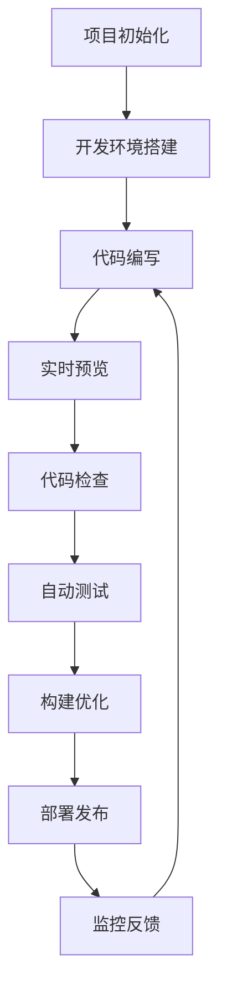

# 第6天：现代HTML工具和工作流学习指南

## 学习目标
- 掌握HTML验证和代码质量工具的使用
- 了解现代HTML开发工作流程
- 学习自动化工具和构建流程基础
- 理解HTML模板引擎的概念和应用
- 初步了解组件化开发思想
- 建立现代前端开发的工程化思维

## 学习时长
- **总时长**: 2-3小时
- **上午理论学习**: 1.5小时
- **下午实践练习**: 1.5小时

## 前置知识
- 熟练掌握HTML5基础语法和语义化标签
- 了解Web标准、无障碍性和SEO优化
- 掌握网页性能优化基础
- 具备基本的命令行操作能力
- 了解Node.js和npm的基本概念

## 理论知识学习

### 1. HTML验证和代码质量工具

**为什么需要HTML验证？**
- **标准合规性**：确保代码符合W3C标准
- **跨浏览器兼容性**：减少浏览器差异导致的问题
- **可维护性**：规范的代码更易于维护和调试
- **SEO优化**：搜索引擎更喜欢标准的HTML结构
- **无障碍性**：正确的HTML结构有助于屏幕阅读器等辅助技术

**HTML验证工具**

1. **W3C Markup Validator**
   - **在线版本**：https://validator.w3.org/
   - **功能**：检查HTML文档是否符合W3C标准
   - **使用方法**：
     - 直接输入URL
     - 上传HTML文件
     - 直接粘贴HTML代码

```html
<!-- 示例：有问题的HTML代码 -->
<!DOCTYPE html>
<html>
<head>
    <title>测试页面</title>
    <!-- 缺少charset声明 -->
</head>
<body>
    <h1>标题</h1>
    <p>这是一个段落
    <!-- 缺少结束标签 -->
    
      <!-- 缺少alt属性 -->
    
    <div>
        <span>嵌套错误</span>
    </p>  <!-- 错误的结束标签 -->
</body>
</html>

<!-- 修正后的HTML代码 -->
<!DOCTYPE html>
<html lang="zh-CN">
<head>
    <meta charset="UTF-8">
    <meta name="viewport" content="width=device-width, initial-scale=1.0">
    <title>测试页面</title>
</head>
<body>
    <h1>标题</h1>
    <p>这是一个段落</p>
    
    
    
    <div>
        <span>正确的嵌套</span>
    </div>
</body>
</html>
```

2. **HTMLHint**
   - **安装**：`npm install -g htmlhint`
   - **功能**：静态代码分析工具，检查HTML代码质量
   - **配置文件**：`.htmlhintrc`

```json
// .htmlhintrc 配置文件示例
{
  "tagname-lowercase": true,
  "attr-lowercase": true,
  "attr-value-double-quotes": true,
  "attr-value-not-empty": false,
  "attr-no-duplication": true,
  "doctype-first": true,
  "tag-pair": true,
  "tag-self-close": false,
  "spec-char-escape": true,
  "id-unique": true,
  "src-not-empty": true,
  "title-require": true,
  "alt-require": true,
  "doctype-html5": true,
  "id-class-value": "dash",
  "style-disabled": false,
  "inline-style-disabled": false,
  "inline-script-disabled": false,
  "space-tab-mixed-disabled": "space",
  "id-class-ad-disabled": false,
  "href-abs-or-rel": false,
  "attr-unsafe-chars": true
}
```

**使用HTMLHint的命令：**
```bash
# 检查单个文件
htmlhint index.html

# 检查多个文件
htmlhint *.html

# 检查目录
htmlhint src/

# 使用特定配置文件
htmlhint --config .htmlhintrc index.html

# 输出格式化结果
htmlhint --format json index.html
```

3. **VS Code扩展工具**

**必备扩展：**
- **HTMLHint**：实时HTML代码检查
- **W3C Web Validator**：集成W3C验证器
- **Auto Rename Tag**：自动重命名配对标签
- **HTML CSS Support**：CSS类名和ID智能提示
- **Live Server**：本地开发服务器
- **Prettier**：代码格式化工具
- **Emmet**：HTML代码快速生成

**Prettier配置示例：**
```json
// .prettierrc 配置文件
{
  "printWidth": 100,
  "tabWidth": 2,
  "useTabs": false,
  "semi": true,
  "singleQuote": false,
  "quoteProps": "as-needed",
  "trailingComma": "es5",
  "bracketSpacing": true,
  "bracketSameLine": false,
  "arrowParens": "avoid",
  "htmlWhitespaceSensitivity": "css",
  "endOfLine": "lf"
}
```

### 2. 现代HTML开发工作流

**传统开发流程 vs 现代开发流程**

**传统流程：**
1. 手动创建HTML文件
2. 直接在浏览器中打开文件
3. 手动刷新页面查看更改
4. 手动压缩和优化代码
5. 手动部署到服务器

**现代流程：**
1. 使用脚手架工具初始化项目
2. 本地开发服务器自动刷新
3. 代码质量检查和自动格式化
4. 自动化构建和优化
5. 持续集成和自动部署

**现代开发工作流组成：**



**项目结构示例：**
```
modern-html-project/
├── src/                    # 源代码目录
│   ├── pages/             # 页面文件
│   │   ├── index.html
│   │   ├── about.html
│   │   └── contact.html
│   ├── components/        # 组件文件
│   │   ├── header.html
│   │   ├── footer.html
│   │   └── navigation.html
│   ├── assets/           # 静态资源
│   │   ├── images/
│   │   ├── styles/
│   │   └── scripts/
│   └── templates/        # 模板文件
├── dist/                 # 构建输出目录
├── tests/               # 测试文件
├── docs/                # 文档
├── .htmlhintrc          # HTMLHint配置
├── .prettierrc          # Prettier配置
├── .gitignore           # Git忽略文件
├── package.json         # 项目配置
├── README.md            # 项目说明
└── gulpfile.js          # 构建配置
```

### 3. 自动化工具和构建流程

**什么是构建工具？**
构建工具是自动化开发流程的工具，可以自动执行重复性任务，如：
- 代码编译和转换
- 文件压缩和优化
- 代码检查和测试
- 文件监听和自动刷新
- 部署和发布

**常用构建工具：**

1. **Gulp**
   - **特点**：基于流的构建工具，配置简单
   - **适用场景**：HTML/CSS/JS项目的自动化处理

```javascript
// gulpfile.js 示例
const gulp = require('gulp');
const htmlmin = require('gulp-htmlmin');
const imagemin = require('gulp-imagemin');
const browserSync = require('browser-sync').create();
const htmlhint = require('gulp-htmlhint');

// HTML压缩任务
gulp.task('html', function() {
  return gulp.src('src/**/*.html')
    .pipe(htmlhint('.htmlhintrc'))
    .pipe(htmlhint.reporter())
    .pipe(htmlmin({
      collapseWhitespace: true,
      removeComments: true,
      removeEmptyAttributes: true,
      removeRedundantAttributes: true,
      useShortDoctype: true
    }))
    .pipe(gulp.dest('dist/'))
    .pipe(browserSync.stream());
});

// 图片优化任务
gulp.task('images', function() {
  return gulp.src('src/assets/images/**/*')
    .pipe(imagemin([
      imagemin.gifsicle({interlaced: true}),
      imagemin.mozjpeg({quality: 75, progressive: true}),
      imagemin.optipng({optimizationLevel: 5}),
      imagemin.svgo({
        plugins: [
          {removeViewBox: true},
          {cleanupIDs: false}
        ]
      })
    ]))
    .pipe(gulp.dest('dist/assets/images/'));
});

// 开发服务器任务
gulp.task('serve', function() {
  browserSync.init({
    server: {
      baseDir: 'dist'
    },
    port: 3000,
    open: true
  });
  
  gulp.watch('src/**/*.html', gulp.series('html'));
  gulp.watch('src/assets/images/**/*', gulp.series('images'));
});

// 构建任务
gulp.task('build', gulp.parallel('html', 'images'));

// 默认任务
gulp.task('default', gulp.series('build', 'serve'));
```

2. **Webpack**
   - **特点**：模块打包工具，功能强大
   - **适用场景**：复杂的前端项目

```javascript
// webpack.config.js 示例（HTML相关配置）
const HtmlWebpackPlugin = require('html-webpack-plugin');
const MiniCssExtractPlugin = require('mini-css-extract-plugin');
const path = require('path');

module.exports = {
  entry: './src/index.js',
  output: {
    path: path.resolve(__dirname, 'dist'),
    filename: 'bundle.js',
    clean: true
  },
  
  module: {
    rules: [
      {
        test: /\.html$/,
        use: ['html-loader']
      },
      {
        test: /\.(png|svg|jpg|jpeg|gif)$/i,
        type: 'asset/resource'
      }
    ]
  },
  
  plugins: [
    new HtmlWebpackPlugin({
      template: './src/index.html',
      filename: 'index.html',
      minify: {
        removeComments: true,
        collapseWhitespace: true,
        removeRedundantAttributes: true,
        useShortDoctype: true,
        removeEmptyAttributes: true,
        removeStyleLinkTypeAttributes: true,
        keepClosingSlash: true,
        minifyJS: true,
        minifyCSS: true,
        minifyURLs: true
      }
    })
  ],
  
  devServer: {
    static: './dist',
    port: 3000,
    open: true,
    hot: true
  }
};
```

3. **Vite**
   - **特点**：现代化构建工具，开发速度快
   - **适用场景**：现代前端项目

```javascript
// vite.config.js 示例
import { defineConfig } from 'vite';
import { resolve } from 'path';

export default defineConfig({
  root: 'src',
  build: {
    outDir: '../dist',
    rollupOptions: {
      input: {
        main: resolve(__dirname, 'src/index.html'),
        about: resolve(__dirname, 'src/about.html'),
        contact: resolve(__dirname, 'src/contact.html')
      }
    },
    minify: 'terser'
  },
  
  server: {
    port: 3000,
    open: true
  },
  
  plugins: [
    // HTML压缩插件
    {
      name: 'html-minify',
      generateBundle(options, bundle) {
        Object.keys(bundle).forEach(fileName => {
          if (fileName.endsWith('.html')) {
            const htmlAsset = bundle[fileName];
            htmlAsset.source = htmlAsset.source
              .replace(/\s+/g, ' ')
              .replace(/> </g, '><');
          }
        });
      }
    }
  ]
});
```

### 4. HTML模板引擎基础

**什么是模板引擎？**
模板引擎是一种工具，允许开发者使用模板和数据来生成HTML。它可以：
- 分离HTML结构和数据
- 实现代码复用
- 支持条件渲染和循环
- 提供组件化开发能力

**常用HTML模板引擎：**

1. **Handlebars**
   - **特点**：语法简单，逻辑较少
   - **适用场景**：简单的模板渲染

```html
<!-- Handlebars模板示例 -->
<!DOCTYPE html>
<html lang="zh-CN">
<head>
    <meta charset="UTF-8">
    <title>{{title}}</title>
</head>
<body>
    <header>
        <h1>{{siteName}}</h1>
        <nav>
            <ul>
                {{#each navigation}}
                <li><a href="{{url}}">{{name}}</a></li>
                {{/each}}
            </ul>
        </nav>
    </header>
    
    <main>
        <h2>{{pageTitle}}</h2>
        
        {{#if showWelcome}}
        <div class="welcome">
            <p>欢迎，{{user.name}}！</p>
        </div>
        {{/if}}
        
        <section class="content">
            {{#each articles}}
            <article>
                <h3>{{title}}</h3>
                <p class="meta">发布于：{{formatDate date}}</p>
                <div class="excerpt">{{excerpt}}</div>
                <a href="{{url}}">阅读更多</a>
            </article>
            {{/each}}
        </section>
    </main>
    
    <footer>
        <p>&copy; {{currentYear}} {{siteName}}. 保留所有权利。</p>
    </footer>
</body>
</html>
```

```javascript
// 使用Handlebars渲染模板
const Handlebars = require('handlebars');
const fs = require('fs');

// 注册辅助函数
Handlebars.registerHelper('formatDate', function(date) {
  return new Date(date).toLocaleDateString('zh-CN');
});

Handlebars.registerHelper('currentYear', function() {
  return new Date().getFullYear();
});

// 读取模板
const templateSource = fs.readFileSync('template.hbs', 'utf8');
const template = Handlebars.compile(templateSource);

// 数据
const data = {
  title: '我的博客 - 首页',
  siteName: '我的博客',
  pageTitle: '最新文章',
  showWelcome: true,
  user: {
    name: '张三'
  },
  navigation: [
    { name: '首页', url: '/' },
    { name: '关于', url: '/about' },
    { name: '联系', url: '/contact' }
  ],
  articles: [
    {
      title: 'HTML5新特性详解',
      date: '2024-01-15',
      excerpt: '本文详细介绍了HTML5的新特性...',
      url: '/articles/html5-features'
    },
    {
      title: 'CSS Grid布局指南',
      date: '2024-01-10',
      excerpt: 'CSS Grid是现代布局的强大工具...',
      url: '/articles/css-grid-guide'
    }
  ]
};

// 渲染HTML
const html = template(data);
fs.writeFileSync('output.html', html);
```

2. **Nunjucks**
   - **特点**：功能丰富，支持继承和包含
   - **适用场景**：复杂的模板系统

```html
<!-- base.njk 基础模板 -->
<!DOCTYPE html>
<html lang="zh-CN">
<head>
    <meta charset="UTF-8">
    <meta name="viewport" content="width=device-width, initial-scale=1.0">
    <title>默认标题</title>
    <link rel="stylesheet" href="/css/main.css">
    
</head>
<body>
    
    
    <main>
        
    </main>
    
    
    
    
</body>
</html>

<!-- header.njk 头部组件 -->
<header class="site-header">
    <div class="container">
        <h1 class="site-title">
            <a href="/">{{ site.name }}</a>
        </h1>
        
        <nav class="main-nav">
            <ul>
                
                <li class="active">
                    <a href="{{ item.url }}">{{ item.name }}</a>
                </li>
                
            </ul>
        </nav>
    </div>
</header>

<!-- index.njk 首页模板 -->


{{ site.name }} - 首页


<section class="hero">
    <div class="container">
        <h2>{{ hero.title }}</h2>
        <p>{{ hero.subtitle }}</p>
        <a href="{{ hero.cta.url }}" class="btn btn-primary">{{ hero.cta.text }}</a>
    </div>
</section>

<section class="articles">
    <div class="container">
        <h2>最新文章</h2>
        
        <div class="article-grid">
            
            <article class="article-card">
                
                
                
                
                <div class="article-content">
                    <h3><a href="{{ article.url }}">{{ article.title }}</a></h3>
                    <p class="article-meta">
                        <time datetime="{{ article.date | date('Y-m-d') }}">
                            {{ article.date | date('Y年m月d日') }}
                        </time>
                        <span class="author">作者：{{ article.author }}</span>
                    </p>
                    <p class="article-excerpt">{{ article.excerpt | truncate(100) }}</p>
                    <a href="{{ article.url }}" class="read-more">阅读更多</a>
                </div>
            </article>
            
        </div>
        
        <div class="text-center">
            <a href="/articles" class="btn btn-outline">查看所有文章</a>
        </div>
    </div>
</section>



<script src="/js/main.js"></script>

```

3. **EJS (Embedded JavaScript)**
   - **特点**：使用JavaScript语法
   - **适用场景**：Node.js项目

```html
<!-- EJS模板示例 -->
<!DOCTYPE html>
<html lang="zh-CN">
<head>
    <meta charset="UTF-8">
    <title><%= title %></title>
</head>
<body>
    <header>
        <h1><%= siteName %></h1>
    </header>
    
    <main>
        <% if (showWelcome) { %>
        <div class="welcome">
            <p>欢迎，<%= user.name %>！</p>
        </div>
        <% } %>
        
        <section class="articles">
            <% articles.forEach(function(article) { %>
            <article>
                <h2><%= article.title %></h2>
                <p class="meta">发布于：<%= article.date.toLocaleDateString('zh-CN') %></p>
                <div class="content"><%- article.content %></div>
            </article>
            <% }); %>
        </section>
    </main>
</body>
</html>
```

### 5. 组件化开发思想

**什么是组件化开发？**
组件化开发是将用户界面拆分成独立、可复用的组件的开发方法。每个组件封装了自己的结构、样式和行为。

**组件化的优势：**
- **可复用性**：组件可以在多个地方使用
- **可维护性**：组件独立，修改不影响其他部分
- **可测试性**：组件可以独立测试
- **团队协作**：不同开发者可以并行开发不同组件
- **一致性**：统一的组件确保界面一致性

**HTML组件化示例：**

```html
<!-- components/button.html -->
<button class="btn btn-{{type}} btn-{{size}}" 
        {{#if disabled}}disabled{{/if}}
        {{#if id}}id="{{id}}"{{/if}}>
    {{#if icon}}
    <i class="icon icon-{{icon}}"></i>
    {{/if}}
    {{text}}
</button>

<!-- components/card.html -->
<div class="card {{#if className}}{{className}}{{/if}}">
    {{#if image}}
    <div class="card-image">
        
    </div>
    {{/if}}
    
    <div class="card-content">
        {{#if title}}
        <h3 class="card-title">{{title}}</h3>
        {{/if}}
        
        {{#if subtitle}}
        <p class="card-subtitle">{{subtitle}}</p>
        {{/if}}
        
        {{#if content}}
        <div class="card-body">
            {{content}}
        </div>
        {{/if}}
        
        {{#if actions}}
        <div class="card-actions">
            {{#each actions}}
            {{> button this}}
            {{/each}}
        </div>
        {{/if}}
    </div>
</div>

<!-- components/navigation.html -->
<nav class="navigation {{#if className}}{{className}}{{/if}}">
    <ul class="nav-list">
        {{#each items}}
        <li class="nav-item {{#if active}}active{{/if}}">
            <a href="{{url}}" class="nav-link"
               {{#if target}}target="{{target}}"{{/if}}
               {{#if rel}}rel="{{rel}}"{{/if}}>
                {{#if icon}}
                <i class="icon icon-{{icon}}"></i>
                {{/if}}
                {{text}}
                {{#if badge}}
                <span class="badge">{{badge}}</span>
                {{/if}}
            </a>
            
            {{#if children}}
            <ul class="nav-submenu">
                {{#each children}}
                <li class="nav-subitem">
                    <a href="{{url}}" class="nav-sublink">{{text}}</a>
                </li>
                {{/each}}
            </ul>
            {{/if}}
        </li>
        {{/each}}
    </ul>
</nav>

<!-- components/hero.html -->
<section class="hero {{#if className}}{{className}}{{/if}}"
         {{#if backgroundImage}}style="background-image: url({{backgroundImage}})"{{/if}}>
    <div class="hero-content">
        {{#if title}}
        <h1 class="hero-title">{{title}}</h1>
        {{/if}}
        
        {{#if subtitle}}
        <p class="hero-subtitle">{{subtitle}}</p>
        {{/if}}
        
        {{#if description}}
        <div class="hero-description">
            {{description}}
        </div>
        {{/if}}
        
        {{#if actions}}
        <div class="hero-actions">
            {{#each actions}}
            {{> button this}}
            {{/each}}
        </div>
        {{/if}}
    </div>
    
    {{#if image}}
    <div class="hero-image">
        
    </div>
    {{/if}}
</section>
```

**使用组件的页面示例：**

```html
<!-- pages/index.html -->
<!DOCTYPE html>
<html lang="zh-CN">
<head>
    <meta charset="UTF-8">
    <meta name="viewport" content="width=device-width, initial-scale=1.0">
    <title>{{site.title}}</title>
    <link rel="stylesheet" href="/css/main.css">
</head>
<body>
    <header class="site-header">
        {{> navigation navigationData}}
    </header>
    
    <main>
        {{> hero heroData}}
        
        <section class="features">
            <div class="container">
                <h2>产品特色</h2>
                <div class="feature-grid">
                    {{#each features}}
                    {{> card this}}
                    {{/each}}
                </div>
            </div>
        </section>
        
        <section class="cta">
            <div class="container">
                <h2>准备开始了吗？</h2>
                <p>立即体验我们的产品</p>
                {{> button ctaButton}}
            </div>
        </section>
    </main>
    
    <footer class="site-footer">
        <div class="container">
            <p>&copy; {{currentYear}} {{site.name}}. 保留所有权利。</p>
        </div>
    </footer>
</body>
</html>
```

**组件数据示例：**

```javascript
// data/components.js
module.exports = {
  navigationData: {
    className: 'main-navigation',
    items: [
      {
        text: '首页',
        url: '/',
        active: true,
        icon: 'home'
      },
      {
        text: '产品',
        url: '/products',
        children: [
          { text: '产品A', url: '/products/a' },
          { text: '产品B', url: '/products/b' }
        ]
      },
      {
        text: '关于我们',
        url: '/about'
      },
      {
        text: '联系我们',
        url: '/contact',
        badge: '新'
      }
    ]
  },
  
  heroData: {
    title: '现代化的解决方案',
    subtitle: '为您的业务提供最佳的技术支持',
    description: '我们致力于为客户提供高质量、高性能的产品和服务。',
    backgroundImage: '/images/hero-bg.jpg',
    actions: [
      {
        text: '立即开始',
        type: 'primary',
        size: 'large',
        icon: 'arrow-right'
      },
      {
        text: '了解更多',
        type: 'outline',
        size: 'large'
      }
    ],
    image: {
      src: '/images/hero-image.jpg',
      alt: '产品展示图片'
    }
  },
  
  features: [
    {
      title: '高性能',
      subtitle: '极速体验',
      content: '采用最新技术，确保最佳性能表现。',
      image: {
        src: '/images/feature-1.jpg',
        alt: '高性能特色'
      },
      actions: [
        {
          text: '了解详情',
          type: 'primary',
          size: 'small'
        }
      ]
    },
    {
      title: '易于使用',
      subtitle: '简单直观',
      content: '用户友好的界面设计，让操作变得简单。',
      image: {
        src: '/images/feature-2.jpg',
        alt: '易用性特色'
      },
      actions: [
        {
          text: '查看演示',
          type: 'outline',
          size: 'small'
        }
      ]
    },
    {
      title: '安全可靠',
      subtitle: '值得信赖',
      content: '企业级安全保障，让您的数据更安全。',
      image: {
        src: '/images/feature-3.jpg',
        alt: '安全性特色'
      },
      actions: [
        {
          text: '安全详情',
          type: 'secondary',
          size: 'small'
        }
      ]
    }
  ],
  
  ctaButton: {
    text: '免费试用',
    type: 'primary',
    size: 'large',
    icon: 'download'
  }
};
```

### 6. 现代HTML开发最佳实践

**代码组织原则：**

1. **模块化结构**
```
src/
├── components/          # 可复用组件
│   ├── ui/             # 基础UI组件
│   │   ├── button/
│   │   ├── card/
│   │   └── modal/
│   ├── layout/         # 布局组件
│   │   ├── header/
│   │   ├── footer/
│   │   └── sidebar/
│   └── business/       # 业务组件
│       ├── product-list/
│       ├── user-profile/
│       └── shopping-cart/
├── pages/              # 页面文件
├── templates/          # 模板文件
├── data/              # 数据文件
└── assets/            # 静态资源
```

2. **命名规范**
```html
<!-- 使用语义化的类名 -->
<article class="blog-post">
    <header class="blog-post__header">
        <h1 class="blog-post__title">文章标题</h1>
        <div class="blog-post__meta">
            <time class="blog-post__date">2024-01-15</time>
            <span class="blog-post__author">作者姓名</span>
        </div>
    </header>
    
    <div class="blog-post__content">
        <p class="blog-post__excerpt">文章摘要...</p>
        <div class="blog-post__body">
            <!-- 文章内容 -->
        </div>
    </div>
    
    <footer class="blog-post__footer">
        <div class="blog-post__tags">
            <span class="tag">HTML</span>
            <span class="tag">前端</span>
        </div>
        <div class="blog-post__actions">
            <button class="btn btn--primary">分享</button>
            <button class="btn btn--secondary">收藏</button>
        </div>
    </footer>
</article>
```

3. **性能优化**
```html
<!-- 资源预加载 -->
<link rel="preload" href="/fonts/main.woff2" as="font" type="font/woff2" crossorigin>
<link rel="preload" href="/css/critical.css" as="style">

<!-- 图片优化 -->
<picture>
    <source media="(min-width: 768px)" srcset="hero-large.webp" type="image/webp">
    <source media="(min-width: 768px)" srcset="hero-large.jpg">
    <source srcset="hero-small.webp" type="image/webp">
    
</picture>

<!-- 懒加载 -->


<!-- 关键CSS内联 -->
<style>
    /* 首屏关键样式 */
    .header { background: #fff; padding: 1rem; }
    .hero { min-height: 50vh; }
</style>

<!-- 非关键CSS异步加载 -->
<link rel="preload" href="/css/non-critical.css" as="style" onload="this.onload=null;this.rel='stylesheet'">
<noscript><link rel="stylesheet" href="/css/non-critical.css"></noscript>
```

4. **可访问性**
```html
<!-- 语义化标签 -->
<main role="main">
    <article>
        <header>
            <h1>文章标题</h1>
            <nav aria-label="文章导航">
                <ol>
                    <li><a href="#section1">第一部分</a></li>
                    <li><a href="#section2">第二部分</a></li>
                </ol>
            </nav>
        </header>
        
        <section id="section1" aria-labelledby="heading1">
            <h2 id="heading1">第一部分</h2>
            <!-- 内容 -->
        </section>
    </article>
</main>

<!-- ARIA属性 -->
<button aria-expanded="false" aria-controls="menu" aria-label="打开菜单">
    <span aria-hidden="true">☰</span>
</button>

<div id="menu" role="menu" aria-hidden="true">
    <a href="/" role="menuitem">首页</a>
    <a href="/about" role="menuitem">关于</a>
</div>

<!-- 表单可访问性 -->
<form>
    <fieldset>
        <legend>个人信息</legend>
        
        <label for="name">姓名 <span aria-label="必填">*</span></label>
        <input type="text" id="name" name="name" required aria-describedby="name-help">
        <div id="name-help" class="help-text">请输入您的真实姓名</div>
        
        <label for="email">邮箱</label>
        <input type="email" id="email" name="email" aria-describedby="email-error">
        <div id="email-error" class="error" role="alert" aria-live="polite"></div>
    </fieldset>
</form>
```

5. **SEO优化**
```html
<!DOCTYPE html>
<html lang="zh-CN">
<head>
    <meta charset="UTF-8">
    <meta name="viewport" content="width=device-width, initial-scale=1.0">
    
    <!-- 基础SEO -->
    <title>页面标题 - 网站名称</title>
    <meta name="description" content="页面描述，不超过160个字符">
    <meta name="keywords" content="关键词1,关键词2,关键词3">
    
    <!-- Open Graph -->
    <meta property="og:title" content="页面标题">
    <meta property="og:description" content="页面描述">
    <meta property="og:image" content="https://example.com/image.jpg">
    <meta property="og:url" content="https://example.com/page">
    <meta property="og:type" content="website">
    
    <!-- Twitter Cards -->
    <meta name="twitter:card" content="summary_large_image">
    <meta name="twitter:title" content="页面标题">
    <meta name="twitter:description" content="页面描述">
    <meta name="twitter:image" content="https://example.com/image.jpg">
    
    <!-- 结构化数据 -->
    <script type="application/ld+json">
    {
      "@context": "https://schema.org",
      "@type": "Article",
      "headline": "文章标题",
      "author": {
        "@type": "Person",
        "name": "作者姓名"
      },
      "datePublished": "2024-01-15",
      "dateModified": "2024-01-15",
      "image": "https://example.com/article-image.jpg",
      "publisher": {
        "@type": "Organization",
        "name": "网站名称",
        "logo": {
          "@type": "ImageObject",
          "url": "https://example.com/logo.jpg"
        }
      }
    }
    </script>
    
    <!-- Canonical URL -->
    <link rel="canonical" href="https://example.com/page">
    
    <!-- 网站图标 -->
    <link rel="icon" type="image/x-icon" href="/favicon.ico">
    <link rel="icon" type="image/png" sizes="32x32" href="/favicon-32x32.png">
    <link rel="icon" type="image/png" sizes="16x16" href="/favicon-16x16.png">
    <link rel="apple-touch-icon" sizes="180x180" href="/apple-touch-icon.png">
</head>
<body>
    <!-- 结构化内容 -->
    <header>
        <nav aria-label="主导航">
            <!-- 导航内容 -->
        </nav>
    </header>
    
    <main>
        <article>
            <header>
                <h1>文章标题</h1>
                <div class="article-meta">
                    <time datetime="2024-01-15">2024年1月15日</time>
                    <address class="author">作者：<a href="/author/name">作者姓名</a></address>
                </div>
            </header>
            
            <div class="article-content">
                <!-- 文章内容 -->
            </div>
        </article>
    </main>
    
    <aside>
        <!-- 侧边栏内容 -->
    </aside>
    
    <footer>
        <!-- 页脚内容 -->
    </footer>
</body>
</html>
```

## 实践练习

### 练习1：搭建现代HTML开发环境

**任务：创建一个完整的现代HTML开发环境，包括工具配置和自动化流程**

1. **项目初始化**

```bash
# 创建项目目录
mkdir modern-html-project
cd modern-html-project

# 初始化npm项目
npm init -y

# 安装开发依赖
npm install --save-dev gulp gulp-htmlmin gulp-htmlhint gulp-imagemin browser-sync prettier htmlhint

# 安装模板引擎
npm install --save-dev handlebars gulp-compile-handlebars
```

2. **创建项目结构**

```bash
# 创建目录结构
mkdir -p src/{pages,components,templates,assets/{images,styles,scripts},data}
mkdir -p dist
mkdir tests docs
```

3. **配置文件**

创建`.htmlhintrc`文件：
```json
{
  "tagname-lowercase": true,
  "attr-lowercase": true,
  "attr-value-double-quotes": true,
  "doctype-first": true,
  "tag-pair": true,
  "spec-char-escape": true,
  "id-unique": true,
  "src-not-empty": true,
  "title-require": true,
  "alt-require": true,
  "doctype-html5": true
}
```

创建`.prettierrc`文件：
```json
{
  "printWidth": 100,
  "tabWidth": 2,
  "useTabs": false,
  "semi": true,
  "singleQuote": false,
  "htmlWhitespaceSensitivity": "css",
  "endOfLine": "lf"
}
```

创建`gulpfile.js`：
```javascript
const gulp = require('gulp');
const htmlmin = require('gulp-htmlmin');
const htmlhint = require('gulp-htmlhint');
const imagemin = require('gulp-imagemin');
const browserSync = require('browser-sync').create();
const handlebars = require('gulp-compile-handlebars');
const rename = require('gulp-rename');
const fs = require('fs');
const path = require('path');

// 路径配置
const paths = {
  src: {
    pages: 'src/pages/**/*.hbs',
    components: 'src/components/**/*.hbs',
    templates: 'src/templates/**/*.hbs',
    images: 'src/assets/images/**/*',
    styles: 'src/assets/styles/**/*.css',
    scripts: 'src/assets/scripts/**/*.js',
    data: 'src/data/**/*.json'
  },
  dist: {
    root: 'dist/',
    images: 'dist/assets/images/',
    styles: 'dist/assets/styles/',
    scripts: 'dist/assets/scripts/'
  }
};

// 读取数据文件
function loadData() {
  const dataPath = path.join(__dirname, 'src/data');
  const data = {};
  
  if (fs.existsSync(dataPath)) {
    fs.readdirSync(dataPath).forEach(file => {
      if (path.extname(file) === '.json') {
        const key = path.basename(file, '.json');
        data[key] = JSON.parse(fs.readFileSync(path.join(dataPath, file), 'utf8'));
      }
    });
  }
  
  return data;
}

// HTML编译任务
gulp.task('html', function() {
  const data = loadData();
  
  const options = {
    ignorePartials: true,
    partials: {
      // 注册组件为partials
    },
    batch: ['src/components', 'src/templates'],
    helpers: {
      // 注册辅助函数
      currentYear: () => new Date().getFullYear(),
      formatDate: (date) => new Date(date).toLocaleDateString('zh-CN')
    }
  };
  
  return gulp.src(paths.src.pages)
    .pipe(handlebars(data, options))
    .pipe(rename({ extname: '.html' }))
    .pipe(htmlhint('.htmlhintrc'))
    .pipe(htmlhint.reporter())
    .pipe(htmlmin({
      collapseWhitespace: true,
      removeComments: true,
      removeEmptyAttributes: true,
      removeRedundantAttributes: true,
      useShortDoctype: true,
      minifyCSS: true,
      minifyJS: true
    }))
    .pipe(gulp.dest(paths.dist.root))
    .pipe(browserSync.stream());
});

// 图片优化任务
gulp.task('images', function() {
  return gulp.src(paths.src.images)
    .pipe(imagemin([
      imagemin.gifsicle({interlaced: true}),
      imagemin.mozjpeg({quality: 75, progressive: true}),
      imagemin.optipng({optimizationLevel: 5}),
      imagemin.svgo({
        plugins: [
          {removeViewBox: true},
          {cleanupIDs: false}
        ]
      })
    ]))
    .pipe(gulp.dest(paths.dist.images));
});

// 复制CSS文件
gulp.task('styles', function() {
  return gulp.src(paths.src.styles)
    .pipe(gulp.dest(paths.dist.styles))
    .pipe(browserSync.stream());
});

// 复制JS文件
gulp.task('scripts', function() {
  return gulp.src(paths.src.scripts)
    .pipe(gulp.dest(paths.dist.scripts))
    .pipe(browserSync.stream());
});

// 开发服务器
gulp.task('serve', function() {
  browserSync.init({
    server: {
      baseDir: paths.dist.root
    },
    port: 3000,
    open: true
  });
  
  gulp.watch([paths.src.pages, paths.src.components, paths.src.templates, paths.src.data], gulp.series('html'));
  gulp.watch(paths.src.images, gulp.series('images'));
  gulp.watch(paths.src.styles, gulp.series('styles'));
  gulp.watch(paths.src.scripts, gulp.series('scripts'));
});

// 清理任务
gulp.task('clean', function() {
  const del = require('del');
  return del([paths.dist.root]);
});

// 构建任务
gulp.task('build', gulp.series('clean', gulp.parallel('html', 'images', 'styles', 'scripts')));

// 开发任务
gulp.task('dev', gulp.series('build', 'serve'));

// 默认任务
gulp.task('default', gulp.series('dev'));
```

4. **创建示例文件**

创建`src/data/site.json`：
```json
{
  "name": "我的网站",
  "title": "现代HTML开发示例",
  "description": "使用现代工具和工作流开发的HTML网站",
  "url": "https://example.com",
  "author": {
    "name": "开发者姓名",
    "email": "developer@example.com"
  },
  "navigation": [
    { "name": "首页", "url": "/", "active": true },
    { "name": "关于", "url": "/about.html" },
    { "name": "联系", "url": "/contact.html" }
  ]
}
```

创建`src/components/header.hbs`：
```html
<header class="site-header">
    <div class="container">
        <h1 class="site-title">
            <a href="/">{{site.name}}</a>
        </h1>
        
        <nav class="main-nav">
            <ul>
                {{#each site.navigation}}
                <li class="{{#if active}}active{{/if}}">
                    <a href="{{url}}">{{name}}</a>
                </li>
                {{/each}}
            </ul>
        </nav>
    </div>
</header>
```

创建`src/components/footer.hbs`：
```html
<footer class="site-footer">
    <div class="container">
        <p>&copy; {{currentYear}} {{site.name}}. 保留所有权利。</p>
        <p>联系我们：<a href="mailto:{{site.author.email}}">{{site.author.email}}</a></p>
    </div>
</footer>
```

创建`src/templates/base.hbs`：
```html
<!DOCTYPE html>
<html lang="zh-CN">
<head>
    <meta charset="UTF-8">
    <meta name="viewport" content="width=device-width, initial-scale=1.0">
    <title>{{#if pageTitle}}{{pageTitle}} - {{/if}}{{site.title}}</title>
    <meta name="description" content="{{#if pageDescription}}{{pageDescription}}{{else}}{{site.description}}{{/if}}">
    <link rel="stylesheet" href="/assets/styles/main.css">
</head>
<body>
    {{> header}}
    
    <main>
        {{{content}}}
    </main>
    
    {{> footer}}
    
    <script src="/assets/scripts/main.js"></script>
</body>
</html>
```

创建`src/pages/index.hbs`：
```html
{{#> base pageTitle="首页" pageDescription="欢迎来到我们的网站首页"}}
{{#*inline "content"}}
<section class="hero">
    <div class="container">
        <h2>欢迎来到{{site.name}}</h2>
        <p>这是一个使用现代HTML开发工具构建的网站示例。</p>
        <a href="/about.html" class="btn btn-primary">了解更多</a>
    </div>
</section>

<section class="features">
    <div class="container">
        <h2>特色功能</h2>
        <div class="feature-grid">
            <div class="feature">
                <h3>现代工具链</h3>
                <p>使用Gulp、Handlebars等现代工具提升开发效率。</p>
            </div>
            <div class="feature">
                <h3>组件化开发</h3>
                <p>模块化的组件设计，提高代码复用性和维护性。</p>
            </div>
            <div class="feature">
                <h3>自动化流程</h3>
                <p>自动化的构建、测试和部署流程。</p>
            </div>
        </div>
    </div>
</section>
{{/inline}}
{{/base}}
```

5. **添加样式和脚本**

创建`src/assets/styles/main.css`：
```css
/* 基础样式 */
* {
    margin: 0;
    padding: 0;
    box-sizing: border-box;
}

body {
    font-family: -apple-system, BlinkMacSystemFont, 'Segoe UI', Roboto, sans-serif;
    line-height: 1.6;
    color: #333;
}

.container {
    max-width: 1200px;
    margin: 0 auto;
    padding: 0 20px;
}

/* 头部样式 */
.site-header {
    background: #fff;
    box-shadow: 0 2px 10px rgba(0,0,0,0.1);
    position: sticky;
    top: 0;
    z-index: 100;
}

.site-header .container {
    display: flex;
    justify-content: space-between;
    align-items: center;
    padding: 1rem 20px;
}

.site-title a {
    text-decoration: none;
    color: #007bff;
    font-size: 1.5rem;
    font-weight: bold;
}

.main-nav ul {
    display: flex;
    list-style: none;
    gap: 2rem;
}

.main-nav a {
    text-decoration: none;
    color: #333;
    font-weight: 500;
    transition: color 0.3s ease;
}

.main-nav a:hover,
.main-nav .active a {
    color: #007bff;
}

/* 主要内容样式 */
.hero {
    background: linear-gradient(135deg, #667eea 0%, #764ba2 100%);
    color: white;
    padding: 4rem 0;
    text-align: center;
}

.hero h2 {
    font-size: 3rem;
    margin-bottom: 1rem;
}

.hero p {
    font-size: 1.2rem;
    margin-bottom: 2rem;
    opacity: 0.9;
}

.btn {
    display: inline-block;
    padding: 0.75rem 1.5rem;
    border: none;
    border-radius: 5px;
    text-decoration: none;
    font-weight: 600;
    transition: all 0.3s ease;
    cursor: pointer;
}

.btn-primary {
    background: #007bff;
    color: white;
}

.btn-primary:hover {
    background: #0056b3;
    transform: translateY(-2px);
}

.features {
    padding: 4rem 0;
}

.features h2 {
    text-align: center;
    margin-bottom: 3rem;
    font-size: 2.5rem;
}

.feature-grid {
    display: grid;
    grid-template-columns: repeat(auto-fit, minmax(300px, 1fr));
    gap: 2rem;
}

.feature {
    text-align: center;
    padding: 2rem;
    background: #f8f9fa;
    border-radius: 10px;
}

.feature h3 {
    margin-bottom: 1rem;
    color: #007bff;
}

/* 页脚样式 */
.site-footer {
    background: #333;
    color: white;
    text-align: center;
    padding: 2rem 0;
}

.site-footer a {
    color: #007bff;
    text-decoration: none;
}

.site-footer a:hover {
    text-decoration: underline;
}

/* 响应式设计 */
@media (max-width: 768px) {
    .site-header .container {
        flex-direction: column;
        gap: 1rem;
    }
    
    .main-nav ul {
        gap: 1rem;
    }
    
    .hero h2 {
        font-size: 2rem;
    }
    
    .feature-grid {
        grid-template-columns: 1fr;
    }
}
```

创建`src/assets/scripts/main.js`：
```javascript
// 主要脚本文件
document.addEventListener('DOMContentLoaded', function() {
    console.log('现代HTML项目已加载');
    
    // 平滑滚动
    const links = document.querySelectorAll('a[href^="#"]');
    links.forEach(link => {
        link.addEventListener('click', function(e) {
            e.preventDefault();
            const target = document.querySelector(this.getAttribute('href'));
            if (target) {
                target.scrollIntoView({
                    behavior: 'smooth',
                    block: 'start'
                });
            }
        });
    });
    
    // 导航高亮
    const currentPath = window.location.pathname;
    const navLinks = document.querySelectorAll('.main-nav a');
    navLinks.forEach(link => {
        if (link.getAttribute('href') === currentPath) {
            link.parentElement.classList.add('active');
        }
    });
});
```

6. **运行项目**

```bash
# 安装依赖
npm install

# 开发模式
npm run dev
# 或者
gulp dev

# 构建生产版本
npm run build
# 或者
gulp build
```

7. **添加package.json脚本**

```json
{
  "scripts": {
    "dev": "gulp dev",
    "build": "gulp build",
    "clean": "gulp clean",
    "lint": "htmlhint src/**/*.html",
    "format": "prettier --write src/**/*.{html,css,js}"
  }
}
```

### 练习2：创建组件化HTML项目

**任务：使用模板引擎创建一个组件化的博客网站**

1. **创建组件**

创建`src/components/article-card.hbs`：
```html
<article class="article-card">
    {{#if image}}
    <div class="article-image">
        
    </div>
    {{/if}}
    
    <div class="article-content">
        <header class="article-header">
            <h3 class="article-title">
                <a href="{{url}}">{{title}}</a>
            </h3>
            
            <div class="article-meta">
                <time datetime="{{date}}">{{formatDate date}}</time>
                <span class="author">{{author}}</span>
                {{#if category}}
                <span class="category">{{category}}</span>
                {{/if}}
            </div>
        </header>
        
        <div class="article-excerpt">
            {{excerpt}}
        </div>
        
        {{#if tags}}
        <div class="article-tags">
            {{#each tags}}
            <span class="tag">{{this}}</span>
            {{/each}}
        </div>
        {{/if}}
        
        <footer class="article-footer">
            <a href="{{url}}" class="read-more">阅读全文</a>
            {{#if readTime}}
            <span class="read-time">{{readTime}}分钟阅读</span>
            {{/if}}
        </footer>
    </div>
</article>
```

创建`src/components/pagination.hbs`：
```html
<nav class="pagination" aria-label="分页导航">
    <ul class="pagination-list">
        {{#if hasPrev}}
        <li class="pagination-item">
            <a href="{{prevUrl}}" class="pagination-link" aria-label="上一页">
                <span aria-hidden="true">&laquo;</span>
                上一页
            </a>
        </li>
        {{/if}}
        
        {{#each pages}}
        <li class="pagination-item {{#if current}}current{{/if}}">
            {{#if current}}
            <span class="pagination-link current" aria-current="page">{{number}}</span>
            {{else}}
            <a href="{{url}}" class="pagination-link">{{number}}</a>
            {{/if}}
        </li>
        {{/each}}
        
        {{#if hasNext}}
        <li class="pagination-item">
            <a href="{{nextUrl}}" class="pagination-link" aria-label="下一页">
                下一页
                <span aria-hidden="true">&raquo;</span>
            </a>
        </li>
        {{/if}}
    </ul>
</nav>
```

创建`src/components/search-form.hbs`：
```html
<form class="search-form" role="search" aria-label="搜索文章">
    <div class="search-input-group">
        <label for="search-input" class="sr-only">搜索关键词</label>
        <input type="search" 
               id="search-input" 
               name="q" 
               placeholder="搜索文章..." 
               aria-describedby="search-help"
               autocomplete="off">
        
        <button type="submit" class="search-button" aria-label="搜索">
            <svg width="20" height="20" viewBox="0 0 24 24" fill="none" stroke="currentColor">
                <circle cx="11" cy="11" r="8"></circle>
                <path d="m21 21-4.35-4.35"></path>
            </svg>
        </button>
    </div>
    
    <div id="search-help" class="search-help">
        输入关键词搜索相关文章
    </div>
</form>
```

2. **创建数据文件**

创建`src/data/blog.json`：
```json
{
  "articles": [
    {
      "id": 1,
      "title": "现代HTML开发最佳实践",
      "excerpt": "探讨现代HTML开发中的最佳实践，包括语义化、可访问性和性能优化。",
      "content": "详细的文章内容...",
      "author": "张三",
      "date": "2024-01-15",
      "category": "前端开发",
      "tags": ["HTML", "最佳实践", "前端"],
      "image": {
        "src": "/assets/images/html-best-practices.jpg",
        "alt": "HTML最佳实践示意图"
      },
      "readTime": 8,
      "url": "/articles/html-best-practices.html"
    },
    {
      "id": 2,
      "title": "CSS Grid布局完全指南",
      "excerpt": "深入了解CSS Grid布局系统，掌握现代网页布局技术。",
      "content": "详细的文章内容...",
      "author": "李四",
      "date": "2024-01-10",
      "category": "CSS",
      "tags": ["CSS", "Grid", "布局"],
      "image": {
        "src": "/assets/images/css-grid-guide.jpg",
        "alt": "CSS Grid布局示意图"
      },
      "readTime": 12,
      "url": "/articles/css-grid-guide.html"
    },
    {
      "id": 3,
      "title": "JavaScript ES2024新特性",
      "excerpt": "了解JavaScript最新版本中的新特性和改进。",
      "content": "详细的文章内容...",
      "author": "王五",
      "date": "2024-01-05",
      "category": "JavaScript",
      "tags": ["JavaScript", "ES2024", "新特性"],
      "readTime": 10,
      "url": "/articles/javascript-es2024.html"
    }
  ],
  "categories": [
    { "name": "前端开发", "count": 15 },
    { "name": "CSS", "count": 8 },
    { "name": "JavaScript", "count": 12 },
    { "name": "工具", "count": 5 }
  ],
  "pagination": {
    "currentPage": 1,
    "totalPages": 3,
    "hasNext": true,
    "hasPrev": false,
    "nextUrl": "/page/2",
    "prevUrl": null,
    "pages": [
      { "number": 1, "url": "/", "current": true },
      { "number": 2, "url": "/page/2", "current": false },
      { "number": 3, "url": "/page/3", "current": false }
    ]
  }
}
```

3. **创建博客首页**

创建`src/pages/blog.hbs`：
```html
{{#> base pageTitle="博客" pageDescription="技术博客文章列表"}}
{{#*inline "content"}}
<div class="blog-layout">
    <div class="container">
        <div class="blog-grid">
            <main class="blog-main">
                <header class="blog-header">
                    <h1>技术博客</h1>
                    <p>分享前端开发技术和经验</p>
                </header>
                
                {{> search-form}}
                
                <section class="articles-section">
                    <h2 class="sr-only">文章列表</h2>
                    
                    <div class="articles-grid">
                        {{#each blog.articles}}
                        {{> article-card this}}
                        {{/each}}
                    </div>
                    
                    {{> pagination blog.pagination}}
                </section>
            </main>
            
            <aside class="blog-sidebar">
                <section class="sidebar-section">
                    <h3>分类</h3>
                    <ul class="category-list">
                        {{#each blog.categories}}
                        <li class="category-item">
                            <a href="/category/{{name}}">{{name}} ({{count}})</a>
                        </li>
                        {{/each}}
                    </ul>
                </section>
                
                <section class="sidebar-section">
                    <h3>最新文章</h3>
                    <ul class="recent-posts">
                        {{#each (slice blog.articles 0 5)}}
                        <li class="recent-post">
                            <a href="{{url}}">{{title}}</a>
                            <time datetime="{{date}}">{{formatDate date}}</time>
                        </li>
                        {{/each}}
                    </ul>
                </section>
            </aside>
        </div>
    </div>
</div>
{{/inline}}
{{/base}}
```

### 练习3：HTML代码质量检查和优化

**任务：为项目添加完整的代码质量检查流程**

1. **创建HTML验证脚本**

创建`scripts/validate-html.js`：
```javascript
const fs = require('fs');
const path = require('path');
const HTMLHint = require('htmlhint').HTMLHint;
const validator = require('html-validator');

// HTMLHint配置
const htmlhintConfig = {
  'tagname-lowercase': true,
  'attr-lowercase': true,
  'attr-value-double-quotes': true,
  'doctype-first': true,
  'tag-pair': true,
  'spec-char-escape': true,
  'id-unique': true,
  'src-not-empty': true,
  'title-require': true,
  'alt-require': true,
  'doctype-html5': true,
  'id-class-value': 'dash',
  'style-disabled': false,
  'inline-style-disabled': false,
  'space-tab-mixed-disabled': 'space',
  'attr-unsafe-chars': true
};

// 获取所有HTML文件
function getHtmlFiles(dir) {
  const files = [];
  
  function traverse(currentDir) {
    const items = fs.readdirSync(currentDir);
    
    items.forEach(item => {
      const fullPath = path.join(currentDir, item);
      const stat = fs.statSync(fullPath);
      
      if (stat.isDirectory()) {
        traverse(fullPath);
      } else if (path.extname(item) === '.html') {
        files.push(fullPath);
      }
    });
  }
  
  traverse(dir);
  return files;
}

// HTMLHint验证
function validateWithHtmlhint(filePath) {
  const content = fs.readFileSync(filePath, 'utf8');
  const messages = HTMLHint.verify(content, htmlhintConfig);
  
  return {
    file: filePath,
    errors: messages.filter(msg => msg.type === 'error'),
    warnings: messages.filter(msg => msg.type === 'warning')
  };
}

// W3C验证
async function validateWithW3C(filePath) {
  try {
    const content = fs.readFileSync(filePath, 'utf8');
    const result = await validator({
      data: content,
      format: 'json'
    });
    
    return {
      file: filePath,
      errors: result.messages.filter(msg => msg.type === 'error'),
      warnings: result.messages.filter(msg => msg.type === 'info')
    };
  } catch (error) {
    return {
      file: filePath,
      errors: [{ message: `验证失败: ${error.message}` }],
      warnings: []
    };
  }
}

// 生成验证报告
function generateReport(results) {
  let report = '# HTML验证报告\n\n';
  report += `生成时间: ${new Date().toLocaleString()}\n\n`;
  
  let totalErrors = 0;
  let totalWarnings = 0;
  
  results.forEach(result => {
    totalErrors += result.errors.length;
    totalWarnings += result.warnings.length;
    
    report += `## ${result.file}\n\n`;
    
    if (result.errors.length === 0 && result.warnings.length === 0) {
      report += '✅ 验证通过\n\n';
    } else {
      if (result.errors.length > 0) {
        report += '### 错误\n\n';
        result.errors.forEach(error => {
          report += `- **行 ${error.line || '?'}**: ${error.message}\n`;
        });
        report += '\n';
      }
      
      if (result.warnings.length > 0) {
        report += '### 警告\n\n';
        result.warnings.forEach(warning => {
          report += `- **行 ${warning.line || '?'}**: ${warning.message}\n`;
        });
        report += '\n';
      }
    }
  });
  
  report += `## 总结\n\n`;
  report += `- 总文件数: ${results.length}\n`;
  report += `- 总错误数: ${totalErrors}\n`;
  report += `- 总警告数: ${totalWarnings}\n`;
  
  return report;
}

// 主函数
async function main() {
  const distDir = path.join(__dirname, '../dist');
  
  if (!fs.existsSync(distDir)) {
    console.error('错误: dist目录不存在，请先构建项目');
    process.exit(1);
  }
  
  const htmlFiles = getHtmlFiles(distDir);
  
  if (htmlFiles.length === 0) {
    console.log('没有找到HTML文件');
    return;
  }
  
  console.log(`找到 ${htmlFiles.length} 个HTML文件，开始验证...`);
  
  const results = [];
  
  // HTMLHint验证
  console.log('\n使用HTMLHint验证...');
  for (const file of htmlFiles) {
    const result = validateWithHtmlhint(file);
    results.push(result);
    
    const status = result.errors.length === 0 ? '✅' : '❌';
    console.log(`${status} ${path.relative(distDir, file)}`);
  }
  
  // W3C验证（可选）
  const useW3C = process.argv.includes('--w3c');
  if (useW3C) {
    console.log('\n使用W3C验证器验证...');
    for (let i = 0; i < htmlFiles.length; i++) {
      const file = htmlFiles[i];
      console.log(`验证 ${path.relative(distDir, file)}...`);
      
      const w3cResult = await validateWithW3C(file);
      
      // 合并结果
      results[i].errors = [...results[i].errors, ...w3cResult.errors];
      results[i].warnings = [...results[i].warnings, ...w3cResult.warnings];
      
      // 添加延迟避免请求过于频繁
      await new Promise(resolve => setTimeout(resolve, 1000));
    }
  }
  
  // 生成报告
  const report = generateReport(results);
  const reportPath = path.join(__dirname, '../validation-report.md');
  fs.writeFileSync(reportPath, report);
  
  console.log(`\n验证完成！报告已保存到: ${reportPath}`);
  
  // 检查是否有错误
  const hasErrors = results.some(result => result.errors.length > 0);
  if (hasErrors) {
    console.log('\n❌ 发现错误，请查看报告并修复');
    process.exit(1);
  } else {
    console.log('\n✅ 所有文件验证通过！');
  }
}

if (require.main === module) {
  main().catch(console.error);
}

module.exports = { validateWithHtmlhint, validateWithW3C, generateReport };
```

2. **创建性能检查脚本**

创建`scripts/performance-check.js`：
```javascript
const fs = require('fs');
const path = require('path');
const { JSDOM } = require('jsdom');

// 性能检查配置
const performanceConfig = {
  maxFileSize: 100 * 1024, // 100KB
  maxImageSize: 500 * 1024, // 500KB
  maxCssFiles: 5,
  maxJsFiles: 5,
  maxImages: 20,
  minImageAlt: true,
  requireLazyLoading: true
};

// 检查文件大小
function checkFileSize(filePath) {
  const stats = fs.statSync(filePath);
  const issues = [];
  
  if (stats.size > performanceConfig.maxFileSize) {
    issues.push({
      type: 'warning',
      message: `文件大小 ${(stats.size / 1024).toFixed(2)}KB 超过建议的 ${performanceConfig.maxFileSize / 1024}KB`
    });
  }
  
  return issues;
}

// 检查HTML内容
function checkHtmlContent(filePath) {
  const content = fs.readFileSync(filePath, 'utf8');
  const dom = new JSDOM(content);
  const document = dom.window.document;
  const issues = [];
  
  // 检查CSS文件数量
  const cssLinks = document.querySelectorAll('link[rel="stylesheet"]');
  if (cssLinks.length > performanceConfig.maxCssFiles) {
    issues.push({
      type: 'warning',
      message: `CSS文件数量 ${cssLinks.length} 超过建议的 ${performanceConfig.maxCssFiles} 个`
    });
  }
  
  // 检查JS文件数量
  const jsScripts = document.querySelectorAll('script[src]');
  if (jsScripts.length > performanceConfig.maxJsFiles) {
    issues.push({
      type: 'warning',
      message: `JavaScript文件数量 ${jsScripts.length} 超过建议的 ${performanceConfig.maxJsFiles} 个`
    });
  }
  
  // 检查图片
  const images = document.querySelectorAll('img');
  if (images.length > performanceConfig.maxImages) {
    issues.push({
      type: 'warning',
      message: `图片数量 ${images.length} 超过建议的 ${performanceConfig.maxImages} 个`
    });
  }
  
  // 检查图片alt属性
  images.forEach((img, index) => {
    if (!img.getAttribute('alt')) {
      issues.push({
        type: 'error',
        message: `第 ${index + 1} 个图片缺少alt属性`
      });
    }
  });
  
  // 检查懒加载
  const nonLazyImages = Array.from(images).filter(img => 
    !img.getAttribute('loading') && 
    !img.closest('picture') && 
    img.getAttribute('src')
  );
  
  if (nonLazyImages.length > 1) { // 第一张图片可以不懒加载
    issues.push({
      type: 'suggestion',
      message: `建议为 ${nonLazyImages.length - 1} 张图片添加 loading="lazy" 属性`
    });
  }
  
  // 检查meta标签
  const viewport = document.querySelector('meta[name="viewport"]');
  if (!viewport) {
    issues.push({
      type: 'error',
      message: '缺少viewport meta标签'
    });
  }
  
  const description = document.querySelector('meta[name="description"]');
  if (!description) {
    issues.push({
      type: 'warning',
      message: '缺少description meta标签'
    });
  }
  
  // 检查标题
  const title = document.querySelector('title');
  if (!title || title.textContent.trim().length === 0) {
    issues.push({
      type: 'error',
      message: '缺少或空的title标签'
    });
  }
  
  return issues;
}

// 生成性能报告
function generatePerformanceReport(results) {
  let report = '# HTML性能检查报告\n\n';
  report += `生成时间: ${new Date().toLocaleString()}\n\n`;
  
  let totalErrors = 0;
  let totalWarnings = 0;
  let totalSuggestions = 0;
  
  results.forEach(result => {
    const errors = result.issues.filter(issue => issue.type === 'error');
    const warnings = result.issues.filter(issue => issue.type === 'warning');
    const suggestions = result.issues.filter(issue => issue.type === 'suggestion');
    
    totalErrors += errors.length;
    totalWarnings += warnings.length;
    totalSuggestions += suggestions.length;
    
    report += `## ${result.file}\n\n`;
    
    if (result.issues.length === 0) {
      report += '✅ 性能检查通过\n\n';
    } else {
      if (errors.length > 0) {
        report += '### ❌ 错误\n\n';
        errors.forEach(error => {
          report += `- ${error.message}\n`;
        });
        report += '\n';
      }
      
      if (warnings.length > 0) {
        report += '### ⚠️ 警告\n\n';
        warnings.forEach(warning => {
          report += `- ${warning.message}\n`;
        });
        report += '\n';
      }
      
      if (suggestions.length > 0) {
        report += '### 💡 建议\n\n';
        suggestions.forEach(suggestion => {
          report += `- ${suggestion.message}\n`;
        });
        report += '\n';
      }
    }
  });
  
  report += `## 总结\n\n`;
  report += `- 总文件数: ${results.length}\n`;
  report += `- 错误: ${totalErrors}\n`;
  report += `- 警告: ${totalWarnings}\n`;
  report += `- 建议: ${totalSuggestions}\n`;
  
  return report;
}

// 主函数
function main() {
  const distDir = path.join(__dirname, '../dist');
  
  if (!fs.existsSync(distDir)) {
    console.error('错误: dist目录不存在，请先构建项目');
    process.exit(1);
  }
  
  const htmlFiles = [];
  
  function findHtmlFiles(dir) {
    const items = fs.readdirSync(dir);
    
    items.forEach(item => {
      const fullPath = path.join(dir, item);
      const stat = fs.statSync(fullPath);
      
      if (stat.isDirectory()) {
        findHtmlFiles(fullPath);
      } else if (path.extname(item) === '.html') {
        htmlFiles.push(fullPath);
      }
    });
  }
  
  findHtmlFiles(distDir);
  
  if (htmlFiles.length === 0) {
    console.log('没有找到HTML文件');
    return;
  }
  
  console.log(`找到 ${htmlFiles.length} 个HTML文件，开始性能检查...`);
  
  const results = [];
  
  htmlFiles.forEach(file => {
    console.log(`检查 ${path.relative(distDir, file)}...`);
    
    const fileSizeIssues = checkFileSize(file);
    const contentIssues = checkHtmlContent(file);
    
    const allIssues = [...fileSizeIssues, ...contentIssues];
    
    results.push({
      file: path.relative(distDir, file),
      issues: allIssues
    });
    
    const status = allIssues.filter(issue => issue.type === 'error').length === 0 ? '✅' : '❌';
    console.log(`${status} ${path.relative(distDir, file)}`);
  });
  
  // 生成报告
  const report = generatePerformanceReport(results);
  const reportPath = path.join(__dirname, '../performance-report.md');
  fs.writeFileSync(reportPath, report);
  
  console.log(`\n性能检查完成！报告已保存到: ${reportPath}`);
  
  // 检查是否有错误
  const hasErrors = results.some(result => 
    result.issues.some(issue => issue.type === 'error')
  );
  
  if (hasErrors) {
    console.log('\n❌ 发现错误，请查看报告并修复');
    process.exit(1);
  } else {
    console.log('\n✅ 所有文件性能检查通过！');
  }
}

if (require.main === module) {
  main();
}

module.exports = { checkFileSize, checkHtmlContent, generatePerformanceReport };
```

3. **更新package.json脚本**

```json
{
  "scripts": {
    "dev": "gulp dev",
    "build": "gulp build",
    "clean": "gulp clean",
    "lint": "htmlhint src/**/*.html",
    "format": "prettier --write src/**/*.{html,css,js}",
    "validate": "node scripts/validate-html.js",
    "validate:w3c": "node scripts/validate-html.js --w3c",
    "perf": "node scripts/performance-check.js",
    "test": "npm run build && npm run validate && npm run perf",
    "ci": "npm run test"
  }
}
```

## 学习检查点

完成今天的学习后，你应该能够：

### 理论知识检查
- [ ] 理解HTML验证的重要性和方法
- [ ] 掌握现代HTML开发工作流程
- [ ] 了解常用的构建工具（Gulp、Webpack、Vite）
- [ ] 理解HTML模板引擎的概念和应用
- [ ] 掌握组件化开发的思想和实践
- [ ] 了解现代HTML开发的最佳实践

### 实践技能检查
- [ ] 能够配置和使用HTMLHint进行代码检查
- [ ] 能够使用Prettier格式化HTML代码
- [ ] 能够搭建基于Gulp的自动化构建流程
- [ ] 能够使用Handlebars创建HTML模板
- [ ] 能够创建可复用的HTML组件
- [ ] 能够编写HTML性能检查脚本

### 工具使用检查
- [ ] 熟练使用VS Code的HTML开发扩展
- [ ] 能够使用命令行工具进行项目管理
- [ ] 能够配置和使用开发服务器
- [ ] 能够使用浏览器开发者工具调试

## 常见问题解答

### Q1: 为什么需要使用构建工具？
**A**: 构建工具可以自动化重复性任务，提高开发效率：
- **自动化处理**：压缩、优化、转换代码
- **实时预览**：自动刷新浏览器
- **代码检查**：自动发现和修复问题
- **模块化开发**：支持组件化和模板化
- **部署优化**：生成优化的生产版本

### Q2: 选择哪个构建工具比较好？
**A**: 根据项目需求选择：
- **Gulp**：适合简单的HTML/CSS/JS项目，配置灵活
- **Webpack**：适合复杂的单页应用，功能强大
- **Vite**：适合现代前端项目，开发速度快
- **Parcel**：零配置，适合快速原型开发

### Q3: 模板引擎有什么优势？
**A**: 模板引擎的主要优势：
- **代码复用**：组件可以在多个页面使用
- **数据分离**：HTML结构与数据分离
- **维护性**：修改组件影响所有使用的地方
- **条件渲染**：根据数据动态显示内容
- **循环渲染**：自动生成重复的HTML结构

### Q4: 如何选择合适的模板引擎？
**A**: 考虑以下因素：
- **学习成本**：Handlebars语法简单，EJS使用JavaScript
- **功能需求**：Nunjucks功能丰富，支持继承
- **项目规模**：小项目用Handlebars，大项目用Nunjucks
- **团队技能**：根据团队JavaScript水平选择

### Q5: 组件化开发的最佳实践是什么？
**A**: 组件化开发最佳实践：
- **单一职责**：每个组件只负责一个功能
- **可配置性**：通过参数控制组件行为
- **可复用性**：组件应该在不同场景下可用
- **文档化**：为组件编写使用文档
- **测试**：为组件编写单元测试

### Q6: 如何优化HTML文件的性能？
**A**: HTML性能优化策略：
- **减少文件大小**：压缩HTML、移除注释
- **优化资源加载**：使用预加载、懒加载
- **减少HTTP请求**：合并CSS/JS文件
- **使用CDN**：加速静态资源加载
- **缓存策略**：设置合适的缓存头

### Q7: 代码质量检查应该包含哪些内容？
**A**: 代码质量检查内容：
- **语法检查**：HTML标签是否正确闭合
- **标准合规**：是否符合W3C标准
- **可访问性**：是否支持屏幕阅读器
- **SEO优化**：是否包含必要的meta标签
- **性能检查**：文件大小、资源数量
- **最佳实践**：是否遵循编码规范

## 参考资源

### 官方文档
- [W3C HTML5规范](https://www.w3.org/TR/html52/)
- [MDN HTML文档](https://developer.mozilla.org/zh-CN/docs/Web/HTML)
- [Gulp官方文档](https://gulpjs.com/)
- [Webpack官方文档](https://webpack.js.org/)
- [Handlebars官方文档](https://handlebarsjs.com/)

### 工具和扩展
- [HTMLHint](https://htmlhint.com/)
- [Prettier](https://prettier.io/)
- [VS Code HTML扩展](https://marketplace.visualstudio.com/items?itemName=ms-vscode.vscode-html-language-features)
- [Live Server扩展](https://marketplace.visualstudio.com/items?itemName=ritwickdey.LiveServer)

### 学习资源
- [现代前端工程化实践](https://github.com/fouber/blog)
- [前端工具链指南](https://frontend-tooling.com/)
- [HTML最佳实践](https://github.com/hail2u/html-best-practices)

---

**下一步学习**：完成第一个模块的学习后，你将进入"模块2-CSS3现代布局技术"，学习现代CSS布局方法和响应式设计。

**学习建议**：
1. 多动手实践，创建自己的项目
2. 尝试不同的工具和工作流
3. 关注前端工程化的最新发展
4. 参与开源项目，学习最佳实践
5. 建立自己的组件库和工具集